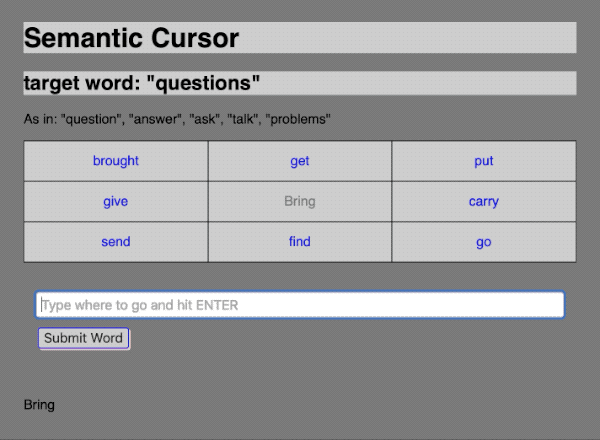

# Semantic Cursor

Semantic Cursor is a small multi-user game where players steer through the space of word2vec towards a target.

My goal was to build a playful exploration of a sematic space. I was also interested in exploring the use of conversational interfaces for collaboration.

Users accessing the app share a single game of Semantic Cursor. The goal is to traverse the semantic space, word by word to get from one random word to another random word.
